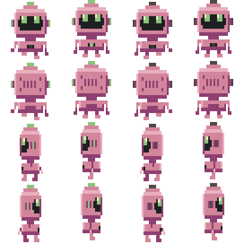

# robofolks

[](https://github.com/kevingoenadibrata/robofolks/actions/workflows/test.yml)
[](https://www.npmjs.com/package/robofolks)

Seeded, animated pixel-robot avatars, in one dependency-free package.

<p align="center">
  
</p>

Any string — a username, an email, a project path — always produces the same
robot: paint, build (walker, tank, ball), antenna, ears and chest panel. They
animate by themselves: working, idle, needing you, or walking in four
directions.

- **No dependencies**, about 25 kB packed.
- **Animated SVGs that need no JavaScript**, so they work in ``, READMEs
  and docs. 1–3 kB gzipped.
- **A web component**, a React component, a DOM helper, PNGs, sprite sheets
  and a CLI — all on the same drawing code.
- **Quiet under `prefers-reduced-motion`**: robots hold still.
- **TypeScript types** for every entry point.

## States

<p align="center">
  
</p>

Left to right: `active` (working), `needs` (needs you), `waiting` (idle).

## Install

```sh
npm install robofolks
```

ES modules with TypeScript types. CommonJS can `require()` it too, on
Node 20.19+ or 22.12+.

## Use

Pure functions, anywhere (Node, workers, build time, the browser):

```js
import { folkTraits, folkSvg } from 'robofolks';

const svg = folkSvg(folkTraits('kevingo'), 'waiting', 0); // SVG string
```

An animated SVG file, no JavaScript needed to play it. Use it in ``,
READMEs, docs, or write it to disk:

```js
import { writeFileSync } from 'node:fs';
import { folkAnimatedSvg } from 'robofolks';

writeFileSync('kevingo.svg', folkAnimatedSvg('kevingo', 'active'));
writeFileSync('kevingo-walk.svg', folkAnimatedSvg('kevingo', 'active', { view: 'left' }));
```

In React:

```jsx
import { RoboFolk } from 'robofolks/react';

<RoboFolk seed="kevingo" state="active" size={48} />
```

As an element, in plain HTML or any framework:

```html
<script type="module">
  import 'robofolks/element'; // registers <robo-folk>
</script>

<robo-folk seed="kevingo" state="active"></robo-folk>
```

Mounted by hand in a page and animating:

```js
import { mountFolk, setFolkState } from 'robofolks/dom';

const folk = mountFolk(document.getElementById('me'), 'kevingo', 'active');
setFolkState(folk, 'needs'); // 'active' | 'needs' | 'waiting'
```

Without a bundler, point an import map at the two modules:

```html
<script type="importmap">
  { "imports": { "robofolks": "/robofolks/index.js", "robofolks/dom": "/robofolks/dom.js" } }
</script>
<script type="module">
  import { mountFolk } from 'robofolks/dom';
</script>
```

From the command line:

```sh
npx robofolks svg kevingo --state active -o kevingo.svg
npx robofolks sheet kevingo --scale 2 -o robot.png --meta robot.json
npx robofolks info kevingo
```

`sheet` writes a walk-cycle sprite sheet — a row per direction, a column per
frame — with `--meta` giving the frame layout for a game engine's atlas:

<p align="center">
  
</p>

## API

### `robofolks`

- `folkTraits(seed, overrides?)`: the robot for `seed`. `overrides` like
  `{ body: 'Blue', build: 'tank' }` win over the seed's picks; unknown values
  are ignored.
- `folkSvg(traits, state, tick)`: one animation frame as an SVG string.
- `folkWalkSvg(traits, view, frame)`: one walk-cycle frame (`front` | `back` |
  `left` | `right`).
- `folkAnimatedSvg(seedOrTraits, state?, { view?, scale? })`: the whole
  animation loop as one self-contained SVG string, played by CSS keyframes.
  It holds its first frame under `prefers-reduced-motion`, and its class names
  are unique to the drawing, so several can sit inline in one page. About
  6–22 kB, or 1–3 kB gzipped. `scale` is pixels per grid unit (default 4, so
  144×176).
- `FOLK_LOOP_TICKS`: how many ticks each animation takes to loop.
- `paintFolkSheet(canvas, traits, scale?)`: a 4×4 walk-cycle sprite sheet on
  any canvas with a 2D context.
- `folkFrame`, `folkWalkFrame`, `folkColors`, `eachFolkRect`: the raw pixel grid,
  for drawing robots some other way.
- `FOLK_PARTS`, `FOLK_PART_NAMES`, `FOLK_BODY_NAMES`, `FOLK_BODIES`, `FOLK_STATES`,
  `FOLK_VIEWS`: every option, for building an editor.
- `FOLK_TICK_MS`: how long one animation tick lasts.

### `robofolks/dom`

- `mountFolk(el, seedOrTraits, state?, { view? })`: draw into `el` and keep
  animating. Pass `view` to show a walk cycle instead of a state.
- `updateFolk(folk, { who?, state?, view? })`: change a mounted robot and redraw.
- `setFolkState(folk, state)`, `unmountFolk(folk)`
- `onFolkTick(fn)`: runs `fn(tick)` on the shared clock; returns an unsubscribe
  function.
- `currentFolkTick()`, `prefersReducedMotion()`

All robots share one clock. It runs only while something is mounted or
listening, drops robots whose element has left the page, and holds still under
`prefers-reduced-motion`.

### `robofolks/element`

Importing it registers `<robo-folk>`. In Node it imports without error and
registers nothing, so server rendering is safe.

| Attribute | Values |
| --- | --- |
| `seed` | any string |
| `state` | `active`, `needs`, `waiting` (default) |
| `view` | `front`, `back`, `left`, `right`: walk that way instead of showing a state |
| `motion` | `css` (default): the animated SVG, no timer. `clock`: the shared clock from `robofolks/dom`, in step with other clock robots, and state changes carry on mid-animation. `none`: the first frame. |
| `body`, `build`, `antenna`, `ears`, `chest` | parts picked by hand |

- `seed`, `state`, `view` and `motion` are also properties; `traits` is the
  robot being shown.
- It's 72px wide at 36:44 by default. Size it with CSS `width`. The drawing
  sits in a shadow root, so page CSS can't reach inside it; style it through
  `::part(robot)`.
- The first frame draws immediately. The animated SVG is built when the
  browser is idle and cached (100 most recent), so a page of robots doesn't
  stall.
- It's an image to assistive tech, labeled "Robot avatar, working" and so on.
  Set `aria-label` to name it yourself.
- `defineRoboFolk(name)` registers it under another tag name too.

Frameworks:

- **React 19+:** use it like any element. To type it in TSX:

  ```ts
  import type { RoboFolkAttributes, RoboFolkElement } from 'robofolks/element';

  declare module 'react' {
    namespace JSX {
      interface IntrinsicElements {
        'robo-folk': RoboFolkAttributes & React.HTMLAttributes<RoboFolkElement>;
      }
    }
  }
  ```

- **Vue:** with templates, tell the compiler it's a custom element:
  `compilerOptions.isCustomElement: (tag) => tag === 'robo-folk'`.
- **Svelte 5:** works as is.

### `robofolks/react`

`<RoboFolk />` draws the SVG itself rather than wrapping the element, so
server rendering gives you the finished robot: no flicker, nothing to hydrate.
Works on React 18 and 19. React is an optional peer dependency.

| Prop | |
| --- | --- |
| `seed` | any string |
| `traits` | a robot to show instead of a seed's, from `folkTraits` |
| `state` | `active`, `needs`, `waiting` (default) |
| `view` | walk this way instead of showing a state |
| `motion` | `css` (default), `clock`, `none`, as for the element |
| `size` | CSS width; default 72 |

Anything else (`className`, `style`, `onClick`, `aria-label`, …) goes to the
wrapping `<span>`.

### `robofolks/png`

- `folkPng(seedOrTraits, state?, { view?, tick?, scale? })`: one frame as PNG
  bytes, transparent background.
- `folkSheetPng(seedOrTraits, { scale? })`: a 4×4 walk-cycle sprite sheet
  (a row per view, a column per frame).
- `folkSheetLayout(scale?)`: where each frame sits, for a game engine's atlas.
- `encodePng({ width, height, data })`: RGBA pixels to PNG bytes.

No dependencies: compression uses `CompressionStream`, so it runs in Node,
Deno, Bun, workers and browsers.

### Command line

```
robofolks svg   <seed> [options]   an animated SVG that plays itself
robofolks png   <seed> [options]   one frame as a PNG
robofolks sheet <seed> [options]   a 4x4 walk-cycle sprite sheet PNG
robofolks info  <seed> [--json]    which robot a seed picks
```

Options: `-o/--out`, `-s/--state`, `-v/--view`, `--scale`, `--tick`,
`--still`, `--meta`, and `--body`, `--build`, `--antenna`, `--ears`,
`--chest` to pick parts by hand. `robofolks --help` lists them with their
values. Without `--out`, text goes to stdout and images can be piped.

## Stability

A seed always gets the same robot within a major version.

- **Major:** a seed picks a different robot, or an existing robot looks
  different.
- **Minor:** new parts, states or functions that leave existing robots alone.
  New parts must not shift the seed's random draws: add new draws at the end
  of `seededTraits` in `src/core.js`, never in the middle.

The markup inside `folkAnimatedSvg` output can change in any release (to make
it smaller, say); what it shows can't.

## Tests

```sh
npm test             # snapshots plus the package entry points
npm run test:update  # regenerate snapshots after an intended change
```

The snapshots pin two things (see `test/cases.js`):

- **seeds:** which robot each of 50 seeds picks. A failure here is a breaking
  change.
- **builds:** every combination of parts, hashed across a full cycle of every
  animation state and every walk direction. A failure here means a robot is
  drawn differently; check it's intended, then update.

`test/animated.test.js` checks that the animated SVG's keyframe plan shows
exactly what the frame-by-frame drawing shows at every tick of every loop, for
every build and chest.

Browser tests run in headless Chrome (set `CHROME_PATH` if it isn't found):

```sh
npm run test:browser                      # <robo-folk>, and animated SVGs played by the browser
npm run test:browser -- --reduced-motion  # the same with reduced motion forced on
```

## Contributing

Issues and pull requests are welcome.

```sh
npm install      # only dev dependencies: React, for its tests
npm test         # 258 tests, no browser needed
npm run images   # regenerate the README images in docs/
```

Two things to keep in mind:

- A seed must keep picking the same robot within a major version (see
  Stability above). `npm test` fails loudly if that changes.
- Every drawing change needs `npm run test:update`, and the diff should be
  checked before committing: it's the record of how the robots look.

## License

MIT © Kevin Goenadibrata
